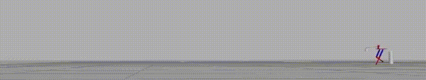
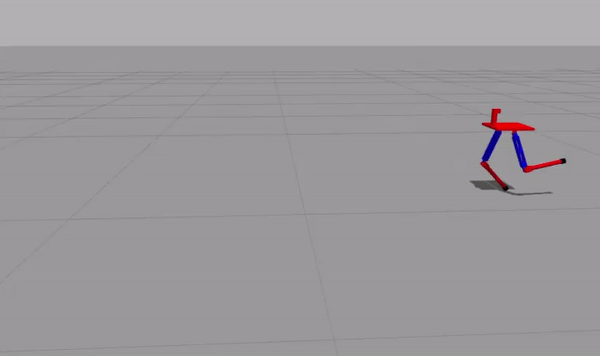
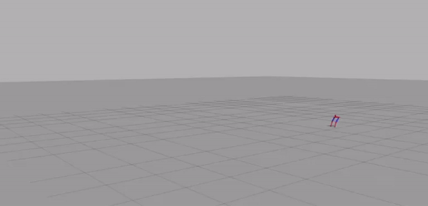
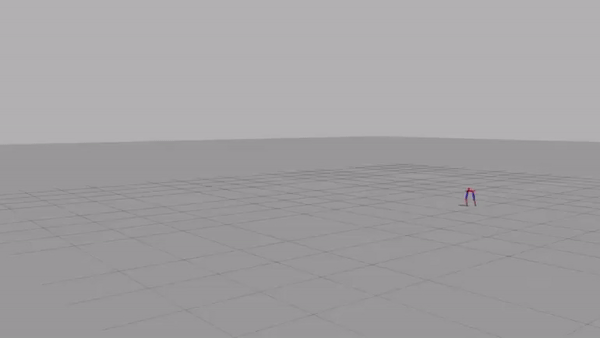

# Reinforcement Learning for Bipedal walking robot.

This repository contains the <b>simulation architecture</b> based in <b>Gazebo</b> environment for implementing reinforcement learning algorithm, <b>DDPG</b> for generating bipedal walking patterns for the robot.

  

## Planar Bipedal walking robot in Gazebo environment using Deep Deterministic Policy Gradient(DDPG).

The <strong>autonomous walking</strong> of the bipedal walking robot is achieved using reinforcement learning algorithm called <a href="https://github.com/nav74neet/ddpg_biped#references"><b>Deep Deterministic Policy Gradient(DDPG)1</b></a>. DDPG is one of the algorithms for <b>learning controls in continuous action spaces</b>.

The project details & the results of the experiment have been documented in the research manuscript, <b><a href="https://arxiv.org/abs/1807.05924v2">Bipedal walking robot using Deep Deterministic Policy Gradient</a></b>

This project was developed at the <a href="https://sites.google.com/site/compintellab/home"><b>Computational Intelligence Laboratory, IISc, Bangalore</b></a>.

## Dependencies & Packages:
- <b><a href="http://releases.ubuntu.com/16.04/">Ubuntu 16.04</a></b>
- <b><a href="http://wiki.ros.org/kinetic">ROS Kinetic</a></b>
- <b><a href="http://gazebosim.org/">Gazebo 7</a></b>
- <b><a href="https://www.tensorflow.org/">TensorFlow: 1.1.0 [with GPU support]</a></b>
- <b><a href="https://gym.openai.com/docs/">gym: 0.9.3</a></b>
- <b>Python 2.7</b>

## File setup:
- ***walker_gazebo*** contains the robot model(both **.stl** files & **.urdf** file) and also the gazebo **launch** file.

- ***walker_controller*** contains the reinforcement learning implementation of **DDPG algorithm** for control of the bipedal walking robot.

## Learning to walk, initial baby steps

  
  

## Stable bipedal walking

  

<strong><a href="https://goo.gl/1hwqJy*">Project video</a></strong>

**Note:** A stable bipedal walking was acheived after training the model using a <strong>Nvidia GeForce GTX 1050 Ti GPU</strong> enabled system for over 41 hours. The visualization for the horizontal boom(attached to the waist) is turned off.

## References:
<ol>
  <li>Lillicrap, Timothy P., et al.<b><a href="https://arxiv.org/abs/1509.02971"> Continuous control with deep reinforcement learning.</a></b> arXiv preprint arXiv:1509.02971 (2015).</li>
<li>Silver, David, et al.<b><a href="http://proceedings.mlr.press/v32/silver14.pdf"> Deterministic Policy Gradient Algorithms.</a></b> ICML (2014).</li>
</ol>

## Project Collaborator(s):
**<a href="https://github.com/ioarun">Arun Kumar</a>** (arunkumar12@iisc.ac.in) & **<a href="http://www.aero.iisc.ernet.in/people/s-n-omkar/">Dr. S N Omkar</a>** (omkar@iisc.ac.in)

## Future work

Implement state of the art RL algorithms(like, TRPO & PPO) for the same. Hopefully lead to faster training and less convergence time.

